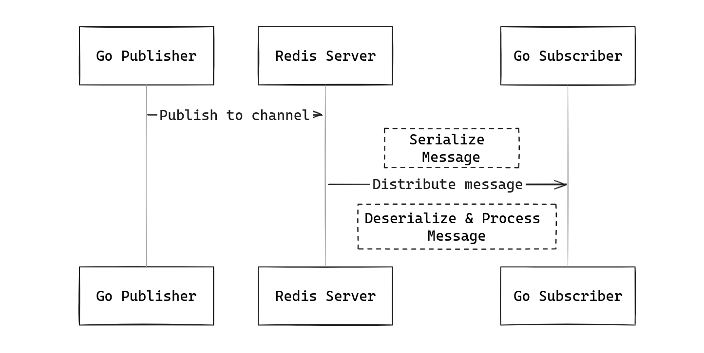

# Redis Message Broker

The architecture of the system is

## How it works
Here's how the different components interact:

**Publisher:**

The Publisher component in the Go application is responsible for publishing messages to Redis channels. It serializes the message data and sends it to Redis using the Publish method, specifying the channel name.

**Subscriber:**

The Subscriber component in the Go application listens to one or more Redis channels. It subscribes to the specified channels using the Subscribe method and receives messages published to those channels. When a message is received, the Subscriber deserializes the message data and processes it according to the application logic.

**Redis Server:**

Redis acts as the message broker in this architecture. It receives messages from the Publisher and distributes them to the subscribed channels. Subscribers connected to those channels receive the published messages.

## Flow of data and events

The flow of data and events can be summarized as follows:

1. The Publisher in the Go application publishes a message to a specific Redis channel.
2. The message is sent to the Redis Server, which acts as the message broker.
3. The Redis Server distributes the message to all Subscribers subscribed to that channel.
4. The Subscriber in the Go application receives the message and processes it according to the defined logic.

This architecture leverages the pub/sub (publish-subscribe) pattern, where the Publisher and Subscribers are decoupled and communicate indirectly through the Redis message broker. This design provides several benefits, including:

- Scalability: Multiple Subscribers can subscribe to the same channel, allowing for parallel processing of messages.
- Loose Coupling: Publishers and Subscribers are not directly aware of each other, promoting a loosely coupled system.
- Asynchronous Communication: Messages are sent asynchronously, allowing the Publisher to continue its operations without waiting for Subscribers to process the messages.
- Reliability: Redis ensures reliable message delivery, preventing message loss in case of network or system failures.

The Redis message broker acts as a central hub for communication, enabling efficient and scalable message distribution within the Go application.